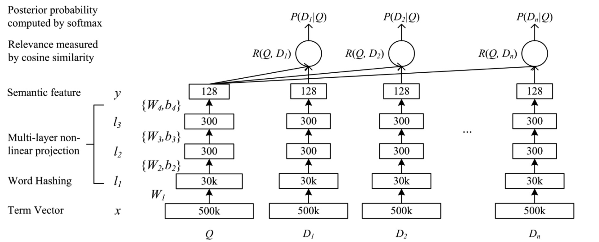

# ref
https://zhuanlan.zhihu.com/p/53326791

# Deep Structured Semantic Model
通过深度神经网络(DNN)把文本(query/句子等)表示成向量，从而能衡量query和doc的相似度
dnn的作用是
  1. 把query doc的term映射成低维稠密向量，即embedding
  2. 计算query和doc之间的相似度

# 网络结构

term-vector -> word-hashing -> multi-layer nonlinear project(隐层)
  -> semantic feature -> relevance by cos-sim
  -> post-probability by softmax

# term-vector
高维词向量

例如 [ES中的词向量](https://www.elastic.co/guide/en/elasticsearch/reference/current/term-vector.html)

- term list
- position of each term
- term 首尾字符在句子中的 offset
- term frequency

# letter n-gram
例如 单词good，做trigram(n=3)
  1. 加 start end 标识，变成 #good#
  2. 转换成多个单词 #goo goo ood ood#

# word-hashing
减少BOW中词向量的维度
例如 有40K个词的词袋，经过trigram后可能变成160K个词，one-hot编码的维度就是160K，用word-hashing后的维度是10K

# 学习目标
最大化给定query下doc的后验概率