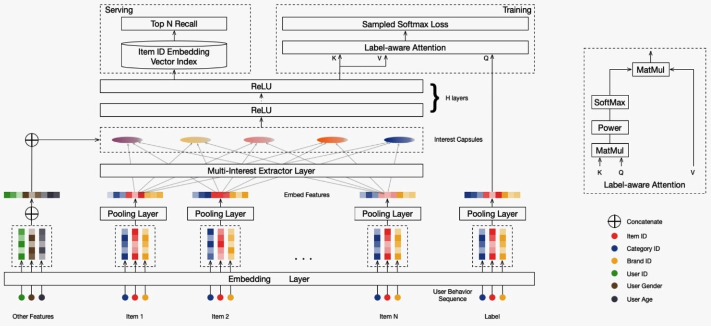

# 介绍
> https://zhuanlan.zhihu.com/p/76495890
> https://zhuanlan.zhihu.com/p/99629077

召回阶段从海量的item中检索出相关item，需要满足相关性和多样性

目前大多数深度网络模型中，都是构建一个user和item统一的向量空间，在该向量空间中获取用户的兴趣表达
如 DIN模型(Deep Interest Network)：通过挖掘用户的历史行为，利用Attention机制捕获用户兴趣分布，表达用户多种多样的兴趣爱好
这类模型都是将用户映射为单个向量以表达用户兴趣，通常不足以捕获用户不同阶段、不同性质的兴趣分布

# MIND：Multi-Interest Network with Dynamic Routing
具有动态路由的多兴趣网络

Mulit-Interest Extractor Layer：获取多个向量表达用户不同方面的兴趣

动态路由：自适应地聚合用户历史行为到用户向量

# 输入数据：大量三元组 (I_u, P_u, F_i)
  - I_u  user历史行为
  - P_u  user基本特征，如：age gender
  - F_i  item基本特征，如：item_id category

# 核心任务：学习2个映射函数
  - V_u = f_user(I_u, P_u)  用户多兴趣向量，d×K矩阵
  - e_i = f_item(F_i)       item向量，d维向量

# 用户多兴趣表征向量
V_u = (v_1, v_2, ..., v_K)
包含K个表征向量，对应K个兴趣
当 K == 1，和YouTube类似

# 网络结构

## training
- F_i
- embedding (for item)
- pooling
- Multi-Interest Extractor Layer
- ReLU hidden layer
- label-aware Attention
- sampled softmax loss